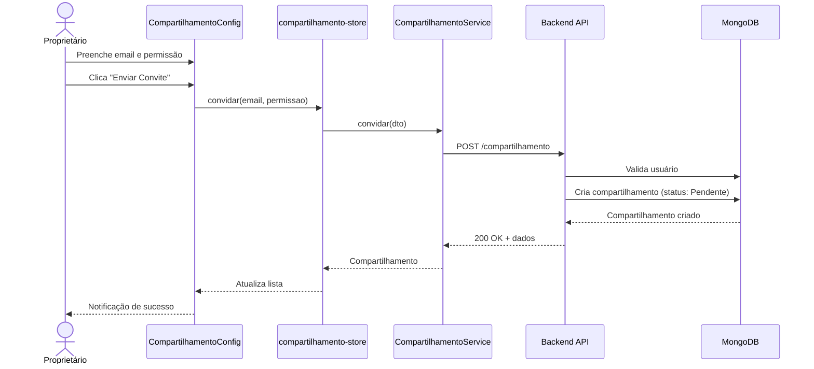

# Fluxo 01: Enviar Convite de Compartilhamento

## 📝 Descrição

Este fluxo descreve como um usuário (proprietário) envia um convite para compartilhar seus dados financeiros com outro usuário (convidado).

## 👥 Atores

- **Proprietário**: Usuário que possui os dados e deseja compartilhar
- **Convidado**: Usuário que receberá acesso aos dados (identificado por email)

## 📋 Pré-requisitos

- Proprietário deve estar autenticado
- Email do convidado deve corresponder a um usuário cadastrado no sistema

## 🔄 Fluxo Principal

### 1. Usuário Acessa Compartilhamento

Existem dois caminhos para enviar um convite:

**Caminho A** (recomendado): Via header da aplicação
```
ContextoSelector (header) → Botão "share" ⟶ CompartilhamentoModal
```

**Caminho B**: Via painel de Configurações
```
Botão Configurações → ModalConfiguracoes → Tab/seção "Compartilhamento" → CompartilhamentoConfig
```

### 2. Preenche Formulário de Convite

**Componente**: `CompartilhamentoConfig.vue`

```vue
<template>
  <q-card>
    <q-card-section>
      <h6>Convidar Usuário</h6>
      <q-input 
        v-model="novoConvite.email" 
        label="Email do usuário"
        type="email"
      />
      <q-select 
        v-model="novoConvite.permissao"
        :options="opcoesPermissao"
        label="Nível de Permissão"
      />
      <q-btn @click="enviarConvite" label="Enviar Convite" />
    </q-card-section>
  </q-card>
</template>
```

**Dados do formulário**:
- `email`: Email do usuário a ser convidado
- `permissao`: `NivelPermissao.Visualizar` (`'Visualizar'`) ou `NivelPermissao.Editar` (`'Editar'`)

### 3. Validação Frontend

**Store**: `compartilhamento-store.ts`

```typescript
async convidar(email: string, permissao: NivelPermissao) {
  this.loading = true;
  
  try {
    // Chama serviço
    const resultado = await CompartilhamentoService.convidar({
      convidadoEmail: email,
      permissao: permissao
    });
    
    // Atualiza lista local
    this.meusCompartilhamentos.push(resultado);
    
    // Notifica sucesso
    Notify.create({
      type: 'positive',
      message: 'Convite enviado com sucesso!'
    });
  } catch (error) {
    // Trata erro
    Notify.create({
      type: 'negative',
      message: error.message || 'Erro ao enviar convite'
    });
  } finally {
    this.loading = false;
  }
}
```

### 4. Requisição HTTP

**Service**: `CompartilhamentoService.ts`

```typescript
async convidar(dto: CriarCompartilhamentoDTO): Promise<Compartilhamento> {
  const response = await api.post('/compartilhamento', dto);
  return response.data;
}
```

**Endpoint**: `POST /api/compartilhamento`

**Headers**:
```
Authorization: Bearer {jwt-token}
Content-Type: application/json
```

**Body**:
```json
{
  "convidadoEmail": "usuario@example.com",
  "permissao": 0
}
```

### 5. Processamento Backend

**Controller**: `Compartilhamento.cs` (WebApi)

```csharp
app.MapPost("/compartilhamento", async (
    CriarCompartilhamentoDTO dto,
    ICompartilhamentoService service) =>
{
    var result = await service.Convidar(dto);
    return result.ToResponse();
});
```

**Service**: `CompartilhamentoService.cs` (Application)

```csharp
public async Task<Result<ResultCompartilhamentoDTO>> Convidar(CriarCompartilhamentoDTO dto)
{
    // 1. Busca usuário convidado pelo email
    var convidado = await _usuarioRepository.ObterPorEmail(dto.ConvidadoEmail);
    if (convidado == null)
        return Result.Failure<ResultCompartilhamentoDTO>(
            Error.NotFound("Usuário não encontrado"));
    
    // 2. Verifica se já existe compartilhamento
    var compartilhamentoExistente = await _repository
        .ObterPorProprietarioEConvidado(_usuarioLogado.Id, convidado.Id);
    
    if (compartilhamentoExistente != null)
        return Result.Failure<ResultCompartilhamentoDTO>(
            Error.Validation("Já existe um compartilhamento com este usuário"));
    
    // 3. Cria novo compartilhamento
    var compartilhamento = new Compartilhamento(
        proprietarioId: _usuarioLogado.Id,
        proprietarioEmail: _usuarioLogado.Usuario.Email,
        proprietarioNome: _usuarioLogado.Usuario.Nome,
        convidadoId: convidado.Id,
        convidadoEmail: convidado.Email,
        permissao: dto.Permissao
    );
    // Status inicial: StatusConvite.Pendente
    
    // 4. Salva no banco
    await _repository.Adicionar(compartilhamento);
    
    // 5. Retorna DTO
    return Result.Success(compartilhamento.Adapt<ResultCompartilhamentoDTO>());
}
```

**Repository**: `CompartilhamentoRepository.cs` (Infra)

```csharp
public async Task Adicionar(Compartilhamento compartilhamento)
{
    await _collection.InsertOneAsync(compartilhamento);
}
```

### 6. Resposta e Atualização UI

**Resposta HTTP**: `200 OK`

```json
{
  "id": "abc123",
  "proprietarioId": "user-1",
  "proprietarioEmail": "proprietario@example.com",
  "proprietarioNome": "João Silva",
  "convidadoId": "user-2",
  "convidadoEmail": "usuario@example.com",
  "permissao": 0,
  "status": 0,
  "dataCriacao": "2026-02-17T19:00:00Z"
}
```

**Frontend atualiza**:
- Adiciona compartilhamento à lista `meusCompartilhamentos`
- Exibe notificação de sucesso
- Atualiza tabela de compartilhamentos enviados

## ✅ Resultado Final

- Registro criado no banco com `status: Pendente`
- Proprietário vê convite na lista de "Compartilhamentos Enviados"
- Convidado verá convite na lista de "Convites Recebidos" quando fizer login

## ❌ Fluxos de Erro

### Email não encontrado

**Backend retorna**: `404 Not Found`
```json
{
  "message": "Usuário não encontrado"
}
```

**Frontend exibe**: Notificação vermelha com mensagem de erro

### Compartilhamento duplicado

**Backend retorna**: `422 Unprocessable Entity`
```json
{
  "message": "Já existe um compartilhamento com este usuário"
}
```

**Frontend exibe**: Notificação vermelha informando duplicação

### Usuário não autenticado

**Backend retorna**: `401 Unauthorized`

**Frontend**: Redireciona para tela de login

## 🔗 Próximos Passos

Após enviar o convite, o convidado precisa:
1. Fazer login no sistema
2. Ver o convite em "Convites Recebidos"
3. Aceitar ou recusar o convite

Ver: [02-responder-convite.md](./02-responder-convite.md)

## 📊 Diagrama de Sequência



## 🔍 Pontos de Atenção

1. **Email case-insensitive**: O backend deve buscar emails ignorando maiúsculas/minúsculas
2. **Validação de duplicação**: Verificar tanto convites pendentes quanto aceitos
3. **Não permitir auto-convite**: Usuário não pode convidar a si mesmo
4. **Limite de compartilhamentos**: Considerar implementar limite por usuário (futuro)
