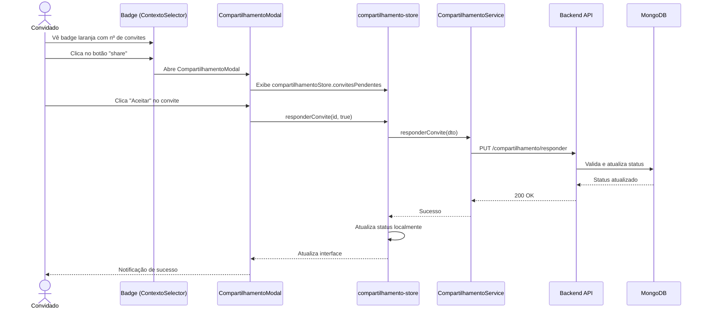

# Fluxo 02: Responder Convite de Compartilhamento

## 📝 Descrição

Este fluxo descreve como um usuário (convidado) visualiza, aceita ou recusa um convite de compartilhamento recebido.

## 👥 Atores

- **Convidado**: Usuário que recebeu o convite e vai responder
- **Proprietário**: Usuário que enviou o convite (não participa ativamente deste fluxo)

## 📋 Pré-requisitos

- Convidado deve estar autenticado
- Deve existir pelo menos um convite com `status: Pendente` para o convidado

## 🔄 Fluxo Principal

### 1. Carregamento Automático de Convites

**Componente**: `MainLayout.vue`

```typescript
onMounted(async () => {
  // Carrega compartilhamentos ao abrir aplicação
  await compartilhamentoStore.carregarCompartilhamentos();
  
  // Restaura contexto se estava em modo compartilhado
  compartilhamentoStore.restaurarContextoDoLocalStorage();
});
```

**Store**: `compartilhamento-store.ts`

```typescript
async function carregarCompartilhamentos() {
  loading.value = true;
  try {
    // Executa em paralelo com guard para garantir array
    const [meus, convites] = await Promise.all([
      CompartilhamentoService.obterMeusCompartilhamentos(),
      CompartilhamentoService.obterConvitesRecebidos()
    ]);
    meusCompartilhamentos.value = Array.isArray(meus) ? meus : [];
    convitesRecebidos.value = Array.isArray(convites) ? convites : [];
  } catch (error) {
    console.error('Erro ao carregar compartilhamentos:', error);
  } finally {
    loading.value = false;
  }
}
```

### 2. Visualização de Convites Pendentes

O convidado pode ver e responder convites em dois lugares:

**Caminho A** (preferencial): badge laranja no botão de compartilhamento do header → `CompartilhamentoModal.vue` → seção "Convites Pendentes"

**Caminho B**: Configurações → aba Compartilhamento → `CompartilhamentoConfig.vue`

**Componente**: `CompartilhamentoModal.vue` (seção Convites Pendentes)

```vue
<template>
  <q-card>
    <q-card-section>
      <h6>Convites Recebidos</h6>
      
      <!-- Lista de convites pendentes -->
      <q-list v-if="compartilhamentoStore.convitesPendentes.length > 0">
        <q-item 
          v-for="convite in compartilhamentoStore.convitesPendentes" 
          :key="convite.id"
        >
          <q-item-section>
            <q-item-label>
              <strong>{{ convite.proprietarioNome }}</strong>
            </q-item-label>
            <q-item-label caption>
              {{ convite.proprietarioEmail }}
            </q-item-label>
            <q-item-label caption>
              Permissão: 
              <q-badge :color="convite.permissao === 0 ? 'blue' : 'green'">
                {{ convite.permissao === 0 ? 'Visualizar' : 'Editar' }}
              </q-badge>
            </q-item-label>
            <q-item-label caption>
              Enviado em: {{ formatarData(convite.dataCriacao) }}
            </q-item-label>
          </q-item-section>
          
          <q-item-section side>
            <div class="q-gutter-sm">
              <q-btn 
                color="positive" 
                icon="check"
                label="Aceitar"
                @click="aceitarConvite(convite.id)"
              />
              <q-btn 
                color="negative" 
                icon="close"
                label="Recusar"
                @click="recusarConvite(convite.id)"
              />
            </div>
          </q-item-section>
        </q-item>
      </q-list>
      
      <!-- Mensagem quando não há convites -->
      <div v-else class="text-center text-grey-6 q-pa-md">
        Nenhum convite pendente
      </div>
    </q-card-section>
  </q-card>
</template>

<script setup lang="ts">
import { useCompartilhamentoStore } from 'src/stores/compartilhamento-store';

const compartilhamentoStore = useCompartilhamentoStore();

async function aceitarConvite(id: string) {
  await compartilhamentoStore.responderConvite(id, true);
}

async function recusarConvite(id: string) {
  await compartilhamentoStore.responderConvite(id, false);
}
</script>
```

**Computed no Store**:

```typescript
// compartilhamento-store.ts
const convitesPendentes = computed(() => {
  return convitesRecebidos.value.filter(
    c => c.status === StatusConvite.Pendente
  );
});
```

### 3. Usuário Aceita o Convite

**Store**: `compartilhamento-store.ts`

```typescript
async function responderConvite(compartilhamentoId: string, aceitar: boolean) {
  await CompartilhamentoService.responderConvite({
    compartilhamentoId,
    aceitar
  });
  // Atualiza o status localmente sem recarregar
  const convite = convitesRecebidos.value.find(c => c.id === compartilhamentoId);
  if (convite) {
    convite.status = aceitar ? StatusConvite.Aceito : StatusConvite.Recusado;
  }
}
```

### 4. Requisição HTTP

**Service**: `CompartilhamentoService.ts`

```typescript
async responder(dto: ResponderConviteDTO): Promise<void> {
  await api.put('/compartilhamento/responder', dto);
}
```

**Endpoint**: `PUT /api/compartilhamento/responder`

**Headers**:
```
Authorization: Bearer {jwt-token}
Content-Type: application/json
```

**Body**:
```json
{
  "compartilhamentoId": "abc123",
  "aceitar": true
}
```

### 5. Processamento Backend

**Controller**: `Compartilhamento.cs` (WebApi)

```csharp
app.MapPut("/compartilhamento/responder", async (
    ResponderConviteDTO dto,
    ICompartilhamentoService service) =>
{
    var result = await service.ResponderConvite(dto);
    return result.ToResponse();
});
```

**Service**: `CompartilhamentoService.cs` (Application)

```csharp
public async Task<Result> ResponderConvite(ResponderConviteDTO dto)
{
    // 1. Busca compartilhamento
    var compartilhamento = await _repository.ObterPorId(dto.CompartilhamentoId);
    
    if (compartilhamento == null)
        return Result.Failure(Error.NotFound("Compartilhamento não encontrado"));
    
    // 2. Valida que é o convidado respondendo
    if (compartilhamento.ConvidadoId != _usuarioLogado.Id)
        return Result.Failure(Error.Forbidden(
            "Apenas o convidado pode responder este convite"));
    
    // 3. Valida que está pendente
    if (compartilhamento.Status != StatusConvite.Pendente)
        return Result.Failure(Error.Validation(
            "Este convite já foi respondido"));
    
    // 4. Atualiza status
    if (dto.Aceitar)
        compartilhamento.Aceitar();  // Muda para StatusConvite.Aceito
    else
        compartilhamento.Recusar();  // Muda para StatusConvite.Recusado
    
    // 5. Salva alteração
    await _repository.Atualizar(compartilhamento);
    
    return Result.Success();
}
```

**Entity**: `Compartilhamento.cs` (Domain)

```csharp
public class Compartilhamento : EntityBase
{
    // ... propriedades ...
    
    public void Aceitar()
    {
        if (Status != StatusConvite.Pendente)
            throw new InvalidOperationException(
                "Apenas convites pendentes podem ser aceitos");
        
        Status = StatusConvite.Aceito;
        DataAtualizacao = DateTime.UtcNow;
    }
    
    public void Recusar()
    {
        if (Status != StatusConvite.Pendente)
            throw new InvalidOperationException(
                "Apenas convites pendentes podem ser recusados");
        
        Status = StatusConvite.Recusado;
        DataAtualizacao = DateTime.UtcNow;
    }
}
```

### 6. Resposta e Atualização UI

**Resposta HTTP**: `200 OK`

**Frontend atualiza**:
1. Remove convite da lista `convitesPendentes`
2. Se aceito, adiciona à lista de compartilhamentos aceitos
3. Exibe notificação de sucesso
4. Atualiza `ContextoSelector` com nova opção (se aceito)

## ✅ Resultado Final - Convite Aceito

### No Banco de Dados

```json
{
  "id": "abc123",
  "proprietarioId": "user-1",
  "convidadoId": "user-2",
  "permissao": 0,
  "status": 1,  // Aceito
  "dataCriacao": "2026-02-17T19:00:00Z",
  "dataAtualizacao": "2026-02-17T19:30:00Z"
}
```

### Na Interface

**ContextoSelector agora mostra**:

```vue
<q-select v-model="contextoAtivo">
  <q-item value="">Meus Dados</q-item>
  <q-item value="user-1">
    Dados de João Silva (Visualizar) <!-- NOVA OPÇÃO -->
  </q-item>
</q-select>
```

**CompartilhamentoConfig mostra**:
- Convite removido de "Convites Pendentes"
- Aparece em "Compartilhamentos Aceitos"

## ✅ Resultado Final - Convite Recusado

### No Banco de Dados

```json
{
  "id": "abc123",
  "status": 2,  // Recusado
  "dataAtualizacao": "2026-02-17T19:30:00Z"
}
```

### Na Interface

- Convite removido de "Convites Pendentes"
- Não aparece em nenhuma lista ativa
- Proprietário pode ver status "Recusado" em seus compartilhamentos enviados

## ❌ Fluxos de Erro

### Convite não encontrado

**Backend retorna**: `404 Not Found`
```json
{
  "message": "Compartilhamento não encontrado"
}
```

### Usuário não é o convidado

**Backend retorna**: `403 Forbidden`
```json
{
  "message": "Apenas o convidado pode responder este convite"
}
```

### Convite já respondido

**Backend retorna**: `422 Unprocessable Entity`
```json
{
  "message": "Este convite já foi respondido"
}
```

## 🔗 Próximos Passos

Após aceitar o convite, o convidado pode:
1. Trocar para o contexto compartilhado
2. Visualizar os dados do proprietário
3. Editar dados (se tiver permissão de Editar)

Ver: [03-trocar-contexto.md](./03-trocar-contexto.md)

## 📊 Diagrama de Sequência



## 🔍 Pontos de Atenção

1. **Validação de propriedade**: Apenas o convidado pode responder
2. **Status único**: Convite só pode ser respondido uma vez
3. **Atualização em tempo real**: Após responder, recarregar listas
4. **Persistência de contexto**: Se usuário já estava em contexto compartilhado, manter após aceitar novo convite
5. **Notificações**: Considerar notificar proprietário quando convite for aceito/recusado (futuro)
