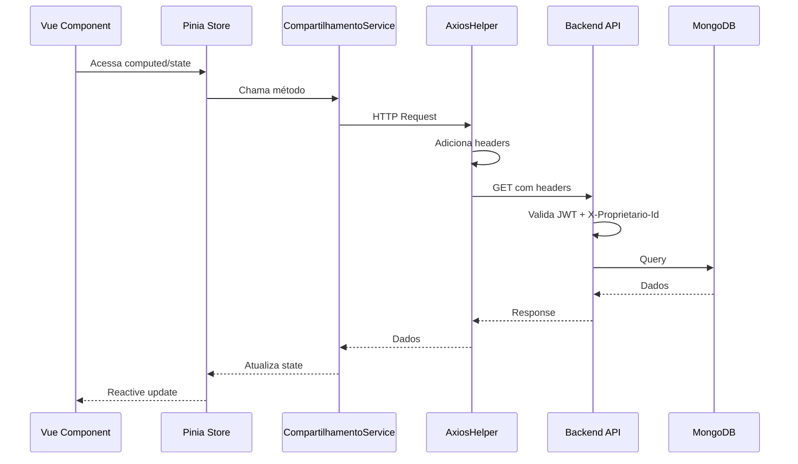
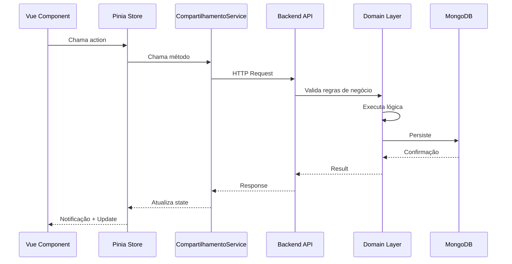
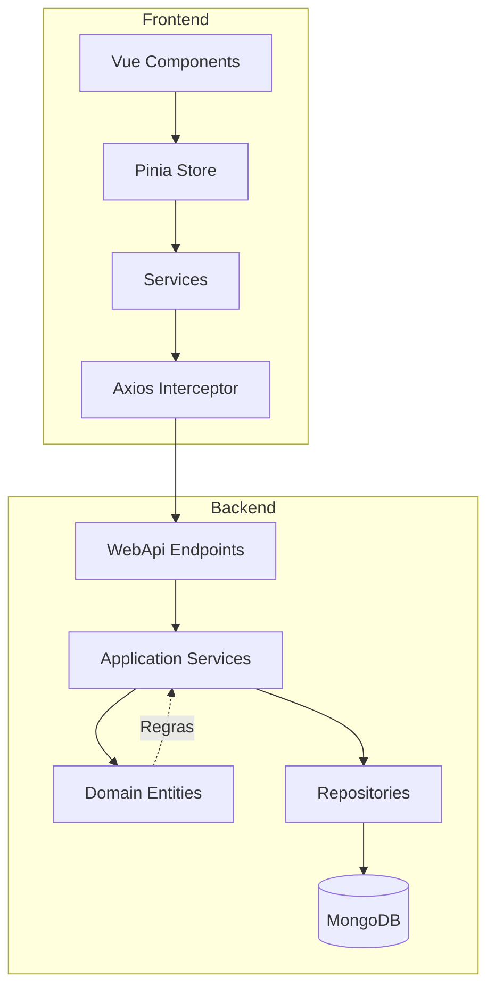

# Arquitetura - Compartilhamento de Informações

## 📐 Visão Geral

A funcionalidade de compartilhamento foi implementada seguindo a arquitetura em camadas existente no projeto, com separação clara entre Backend e Frontend.

## 🏗️ Backend - Arquitetura em Camadas

### Estrutura de Pastas

```
Modulos/GerenciamentoMensal/
├── Domain/
│   └── Compartilhamento/
│       ├── Entity/
│       │   ├── Compartilhamento.cs
│       │   ├── NivelPermissao.cs (enum)
│       │   └── StatusConvite.cs (enum)
│       └── Interfaces/
│           └── ICompartilhamentoRepository.cs
│
├── Application/
│   └── Compartilhamento/
│       ├── DTOs/
│       │   ├── CriarCompartilhamentoDTO.cs
│       │   ├── ResponderConviteDTO.cs
│       │   ├── AtualizarPermissaoDTO.cs
│       │   └── ResultCompartilhamentoDTO.cs
│       ├── Interfaces/
│       │   └── ICompartilhamentoService.cs
│       └── Services/
│           └── CompartilhamentoService.cs
│
├── Infra.data/
│   └── Compartilhamento/
│       ├── CompartilhamentoMapping.cs
│       └── CompartilhamentoRepository.cs
│
└── WebApi/
    ├── Endpoints/
    │   └── Compartilhamento.cs
    └── Interceptor/
        └── UsuarioLogado.cs (modificado)
```

### Camada Domain

**Responsabilidade**: Regras de negócio e entidades

**Componentes**:

1. **Compartilhamento.cs** - Entidade principal
   ```csharp
   public class Compartilhamento : EntityBase
   {
       public string ProprietarioId { get; private set; }
       public string ConvidadoId { get; private set; }
       public NivelPermissao Permissao { get; private set; }
       public StatusConvite Status { get; private set; }
       
       public void Aceitar() { ... }
       public void Recusar() { ... }
       public void AtualizarPermissao(NivelPermissao nova) { ... }
   }
   ```

2. **Enums**:
   - `NivelPermissao`: Visualizar (0), Editar (1)
   - `StatusConvite`: Pendente (0), Aceito (1), Recusado (2)

3. **ICompartilhamentoRepository** - Contrato de persistência

### Camada Application

**Responsabilidade**: Casos de uso e lógica de aplicação

**Componentes**:

1. **CompartilhamentoService.cs** - Implementa casos de uso
   - `Convidar()` - Criar compartilhamento
   - `ResponderConvite()` - Aceitar/recusar
   - `AtualizarPermissao()` - Mudar permissão
   - `Excluir()` - Revogar/sair
   - `ListarMeus()` - Compartilhamentos criados
   - `ListarRecebidos()` - Convites recebidos

2. **DTOs** - Transferência de dados entre camadas

### Camada Infra

**Responsabilidade**: Persistência e infraestrutura

**Componentes**:

1. **CompartilhamentoMapping.cs** - Mapeamento MongoDB
   ```csharp
   BsonClassMap.RegisterClassMap<Compartilhamento>(cm =>
   {
       cm.AutoMap();
       cm.MapIdProperty(c => c.Id);
       cm.MapProperty(c => c.ProprietarioId);
       // ...
   });
   ```

2. **CompartilhamentoRepository.cs** - Implementação de persistência
   - Usa MongoDB com `IMongoCollection<Compartilhamento>`

### Camada WebApi

**Responsabilidade**: Exposição de endpoints HTTP

**Componentes**:

1. **Compartilhamento.cs** - Endpoints Minimal API
   ```csharp
   app.MapPost("/compartilhamento", ...);
   app.MapPut("/compartilhamento/responder", ...);
   app.MapPut("/compartilhamento/permissao", ...);
   app.MapDelete("/compartilhamento/{id}", ...);
   app.MapGet("/compartilhamento/meus", ...);
   app.MapGet("/compartilhamento/recebidos", ...);
   ```

2. **UsuarioLogado.cs** - Interceptor modificado
   - Adiciona propriedades: `IdContextoDados`, `EmModoCompartilhado`, `PermissaoAtual`
   - Valida header `X-Proprietario-Id`

## 🎨 Frontend - Arquitetura Vue 3

### Estrutura de Pastas

```
src/
├── models/
│   └── Compartilhamento.ts          ← enums string, interface ContextoCompartilhado
│
├── services/
│   └── CompartilhamentoService.ts
│
├── stores/
│   ├── compartilhamento-store.ts
│   └── UserEmail-Store.ts           ← usado por CompartilhamentoModal
│
├── components/
│   └── Compartilhamento/
│       ├── ContextoSelector.vue        ← redesenhado (dropdown + botão modal)
│       ├── BannerModoCompartilhado.vue ← renomeado de BannerCompartilhado.vue
│       ├── CompartilhamentoModal.vue   ← NOVO (modal estilo Google Drive)
│       └── CompartilhamentoConfig.vue
│
├── pages/
│   └── GerenciamentoMensal/
│       ├── RendimentoPage.vue (modificado)
│       ├── DespesaPage.vue (modificado)
│       └── InvestimentoPage.vue (modificado)
│
└── helpers/
    └── AxiosHelper.ts (modificado)
```

### Camada de Modelos

**Arquivo**: `models/Compartilhamento.ts`

> ⚠️ **Mudança importante**: Os enums passaram de valores **numéricos** para valores **string**, alinhando-se com o que a API retorna diretamente.

```typescript
export enum NivelPermissao {
  Visualizar = 'Visualizar',
  Editar = 'Editar'
}

export enum StatusConvite {
  Pendente = 'Pendente',
  Aceito = 'Aceito',
  Recusado = 'Recusado'
}

export interface Compartilhamento {
  id: string;
  proprietarioId: string;
  proprietarioEmail: string;
  proprietarioNome: string;
  convidadoId: string;
  convidadoEmail: string;
  permissao: NivelPermissao;
  status: StatusConvite;
  dataCriacao: string;
  // dataAtualizacao removida — não mais exposta pelo backend
}

export interface CriarCompartilhamentoDTO {
  convidadoEmail: string;
  permissao: NivelPermissao;
}

export interface AtualizarPermissaoDTO {
  compartilhamentoId: string;
  novaPermissao: NivelPermissao;
}

export interface ResponderConviteDTO {
  compartilhamentoId: string;
  aceitar: boolean;
}

// Interface para o contexto ativo no store (dados resumidos do compartilhamento ativo)
export interface ContextoCompartilhado {
  proprietarioId: string;
  proprietarioNome: string;
  permissao: NivelPermissao;
}
```

### Camada de Serviços

**Arquivo**: `services/CompartilhamentoService.ts`

**Responsabilidade**: Comunicação com API

```typescript
class CompartilhamentoService {
  async convidar(dto: CriarCompartilhamentoDTO): Promise<Compartilhamento>
  async responder(dto: ResponderConviteDTO): Promise<void>
  async atualizarPermissao(dto: AtualizarPermissaoDTO): Promise<void>
  async excluir(id: string): Promise<void>
  async listarMeus(): Promise<Compartilhamento[]>
  async listarRecebidos(): Promise<Compartilhamento[]>
}
```

### Camada de Estado (Pinia Store)

**Arquivo**: `stores/compartilhamento-store.ts`

**Responsabilidade**: Gerenciamento de estado global

```typescript
export const useCompartilhamentoStore = defineStore('compartilhamento', () => {
  // Estado
  const meusCompartilhamentos = ref<Compartilhamento[]>([]);
  const convitesRecebidos = ref<Compartilhamento[]>([]);
  const contextoAtivo = ref<ContextoCompartilhado | null>(null);
  const loading = ref(false);
  
  // Computed
  const emModoCompartilhado = computed(() => contextoAtivo.value !== null);
  const podeEditar = computed(() => {
    if (!emModoCompartilhado.value) return true;
    return contextoAtivo.value?.permissao === NivelPermissao.Editar;
  });
  const compartilhamentosAceitos = computed(() =>
    convitesRecebidos.value.filter(c => c.status === StatusConvite.Aceito)
  );
  const convitesPendentes = computed(() =>
    convitesRecebidos.value.filter(c => c.status === StatusConvite.Pendente)
  );
  
  // Actions
  async function carregarCompartilhamentos() { ... }  // Usa Promise.all + guards de Array
  function ativarContexto(compartilhamento: Compartilhamento) { ... }  // Salva no localStorage
  function desativarContexto() { ... }  // Remove do localStorage
  function restaurarContextoDoLocalStorage() { ... }  // Chamado no onMounted do MainLayout
  async function convidar(email, permissao) { ... }
  async function responderConvite(id, aceitar) { ... }  // Atualiza status localmente
  async function atualizarPermissao(id, novaPermissao) { ... }  // Atualiza localmente
  async function revogar(id) { ... }  // Remove localmente
});
```

### Camada de Componentes

**Componentes Principais**:

1. **ContextoSelector.vue** - Dropdown + botão de compartilhamento (integra `CompartilhamentoModal`)
2. **CompartilhamentoModal.vue** - Modal de gerenciamento de compartilhamento (estilo Google Drive)
3. **BannerModoCompartilhado.vue** - Banner indicativo do modo compartilhado (inserido nas páginas)
4. **CompartilhamentoConfig.vue** - Painel de gerenciamento (nas Configurações)

**Integração**: `MainLayout.vue`

```vue
<template>
  <q-layout>
    <q-header>
      <!-- Visível apenas em telas > sm -->
      <ContextoSelector v-if="$q.screen.gt.sm" />
    </q-header>
    
    <q-page-container>
      <!-- BannerModoCompartilhado NÃO é mais global — inserido nas páginas -->
      <!-- key garante re-renderização ao trocar contexto -->
      <router-view :key="compartilhamentoStore.contextoAtivo?.proprietarioId || 'meus-dados'" />
    </q-page-container>
  </q-layout>
</template>
```

### Interceptor HTTP

**Arquivo**: `helpers/AxiosHelper.ts`

**Responsabilidade**: Adicionar headers automáticos

```typescript
api.interceptors.request.use(config => {
  // JWT Token
  const token = localStorage.getItem('token');
  if (token) {
    config.headers.Authorization = `Bearer ${token}`;
  }
  
  // Contexto compartilhado
  const proprietarioId = localStorage.getItem('proprietarioIdAtivo');
  if (proprietarioId) {
    config.headers['X-Proprietario-Id'] = proprietarioId;
  }
  
  return config;
});
```

## 🔄 Fluxo de Dados

### Leitura (GET)



### Escrita (POST/PUT/DELETE)



## 🔐 Segurança

### Validação em Múltiplas Camadas

1. **Frontend**: Oculta UI (UX)
2. **API**: Valida JWT e header
3. **Service**: Valida permissões
4. **Domain**: Valida regras de negócio
5. **Repository**: Valida propriedade dos dados

### Princípios Aplicados

- **Defense in Depth**: Validação em todas as camadas
- **Least Privilege**: Permissões mínimas necessárias
- **Fail Secure**: Em caso de erro, nega acesso
- **Auditability**: Todas as ações rastreáveis

## 📊 Diagrama de Arquitetura Completo



## 🔍 Padrões Utilizados

### Backend

- **Repository Pattern**: Abstração de persistência
- **Service Layer**: Lógica de aplicação
- **DTO Pattern**: Transferência de dados
- **Result Pattern**: Tratamento de erros
- **Dependency Injection**: Inversão de controle

### Frontend

- **Composition API**: Vue 3 moderno
- **Store Pattern**: Pinia para estado global
- **Service Pattern**: Separação de lógica HTTP
- **Computed Properties**: Reatividade otimizada
- **Interceptor Pattern**: Middleware HTTP

## 🔗 Relacionados

- [componentes.md](./componentes.md) - Detalhes dos componentes Vue
- [api-endpoints.md](./api-endpoints.md) - Documentação da API
